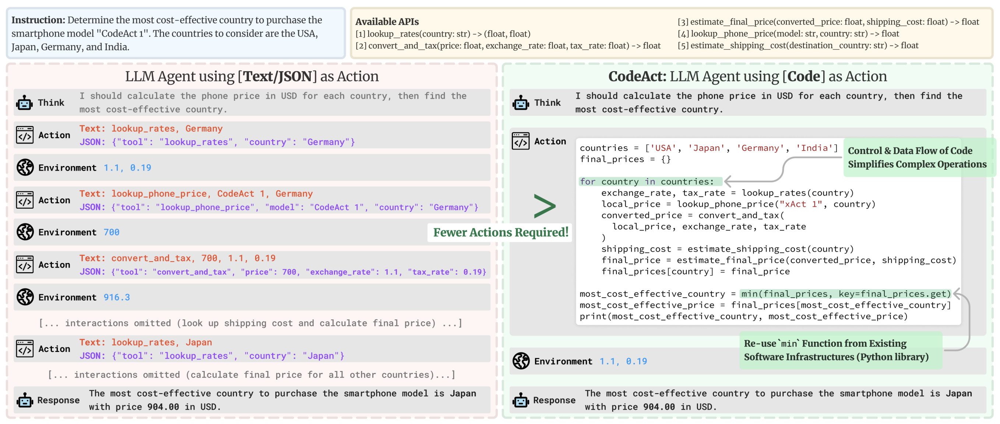

# 🤗 AI Agents Course
How Agents work and how to build your own Agents using the latest libraries and tools.

# Objectives
- 📖 Study AI Agents in theory, design, and practice.
- 🧑‍💻 Learn to use established AI Agent libraries such as smolagents, LlamaIndex, and LangGraph.
- 💾 Share your agents on the Hugging Face Hub and explore agents created by the community.
- 🏆 Participate in challenges where you will evaluate your agents against other students’.
- 🎓 Earn a certificate of completion by completing assignments.

## Introduction to Agents
- Understanding Agents
    - What is an Agent, and how does it work?
    - How do Agents make decisions using reasoning and planning?
- The Role of LLMs (Large Language Models) in Agents
    - How LLMs serve as the “brain” behind an Agent.
    - How LLMs structure conversations via the Messages system.
- Tools and Actions
    - How Agents use external tools to interact with the environment.
    - How to build and integrate tools for your Agent.
- The Agent Workflow:
    - Think → Act → Observe.

> After exploring these topics, we’ll build your first Agent using [smolagents](https://huggingface.co/docs/smolagents/index)!

## The Spectrum of Agency
| Agency Level | Description | What that’s called | Example pattern |
| --- | --- | --- | --- |
| ☆☆☆ | Agent output has no impact on program flow | Simple processor | `process_llm_output(llm_response)` |
| ★☆☆ | Agent output determines basic control flow | Router | `if llm_decision(): path_a() else: path_b()` |
| ★★☆ | Agent output determines function execution | Tool caller | `run_function(llm_chosen_tool, llm_chosen_args)` |
| ★★★ | Agent output controls iteration and program continuation | Multi-step Agent | `while llm_should_continue(): execute_next_step()` |
| ★★★ | One agentic workflow can start another agentic workflow | Multi-Agent | `if llm_trigger(): execute_agent()` |

> Hugging Face free [NLP Course](https://huggingface.co/learn/nlp-course/chapter1/1)

> The easiest way to ensure your LLM receives a conversation correctly formatted is to use the `chat_template` from the model’s tokenizer.  Read more about how transformers uses chat templates [here](https://huggingface.co/docs/transformers/main/en/chat_templating). 

## Tools
Tools play a crucial role in enhancing the capabilities of AI agents.

- What Tools Are: Functions that give LLMs extra capabilities, such as performing calculations or accessing external data.
- How to Define a Tool: By providing a clear textual description, inputs, outputs, and a callable function.
- Why Tools Are Essential: They enable Agents to overcome the limitations of static model training, handle real-time tasks, and perform specialized actions.

### Model Context Protocol (MCP): a unified tool interface
**Model Context Protocol (MCP)** is an open protocol that standardizes how applications provide tools to LLMs. 

MCP provides:
- A growing list of pre-built integrations that your LLM can directly plug into
- The flexibility to switch between LLM providers and vendors
- Best practices for securing your data within your infrastructure

This means that any framework implementing MCP can leverage tools defined within the protocol, eliminating the need to reimplement the same tool interface for each framework.

## The Thought-Action-Observation Cycle
Agents work in a continuous cycle of: *thinking (Thought) → acting (Act) and observing (Observe)*.

Let’s break down these actions together:
- Thought: The LLM part of the Agent decides what the next step should be.
- Action: The agent takes an action, by calling the tools with the associated arguments.
- Observation: The model reflects on the response from the tool.

The three components work together in a continuous loop. To use an analogy from programming, the agent uses a while loop: the loop continues until the objective of the agent has been fulfilled. In many Agent frameworks, the rules and guidelines are embedded directly into the system prompt, ensuring that every cycle adheres to a defined logic.

## Thought: Internal Reasoning and the Re-Act Approach
Thoughts represent the **Agent’s internal reasoning and planning processes** to solve the task.
- This utilises the agent’s Large Language Model (LLM) capacity to analyze information when presented in its prompt.
- Think of it as the agent’s internal dialogue, where it considers the task at hand and strategizes its approach.

The Agent’s thoughts are responsible for accessing current observations and decide what the next action(s) should be. Through this process, the agent can break down complex problems into smaller, more manageable steps, reflect on past experiences, and continuously adjust its plans based on new information.

> **The Re-Act Approach** : A key method is the ReAct approach, which is the concatenation of “Reasoning” (Think) with “Acting” (Act). ReAct is a simple prompting technique that appends “Let’s think step by step” before letting the LLM decode the next tokens.

Indeed, prompting the model to think “step by step” encourages the decoding process toward next tokens that generate a plan, rather than a final solution, since the model is encouraged to decompose the problem into sub-tasks.

## Actions: Enabling the Agent to Engage with Its Environment
Actions are the concrete steps an AI agent takes to interact with its environment. Whether it’s browsing the web for information or controlling a physical device, each action is a deliberate operation executed by the agent.

There are multiple types of Agents that take actions differently:

| Type of Agent | Description |
| --- | --- |
| JSON Agent | The Action to take is specified in JSON format. |
| Code Agent | The Agent writes a code block that is interpreted externally. |
| Function-calling Agent | It is a subcategory of the JSON Agent which has been fine-tuned to generate a new message for each action. |

> One crucial part of an agent is the ability to **STOP** generating new tokens when an action is complete, and that is true for all formats of Agent: JSON, code, or function-calling. This prevents unintended output and ensures that the agent’s response is clear and precise.

## The Stop and Parse Approach
One key method for implementing actions is the stop and parse approach. 
This method ensures that the agent’s output is structured and predictable:

- **Generation in a Structured Format**: The agent outputs its intended action in a clear, predetermined format (JSON or code).

- **Halting Further Generation**: Once the action is complete, the agent stops generating additional tokens. This prevents extra or erroneous output.

- **Parsing the Output**: An external parser reads the formatted action, determines which Tool to call, and extracts the required parameters.

## Code Agents
An alternative approach is using Code Agents. The idea is: *instead of outputting a simple JSON object, a Code Agent generates an executable code block*—typically in a high-level language like Python.

This approach offers several advantages:

- **Expressiveness**: Code can naturally represent complex logic, including loops, conditionals, and nested functions, providing greater flexibility than JSON.
- **Modularity and Reusability**: Generated code can include functions and modules that are reusable across different actions or tasks.
- **Enhanced Debuggability**: With a well-defined programming syntax, code errors are often easier to detect and correct.
- **Direct Integration**: Code Agents can integrate directly with external libraries and APIs, enabling more complex operations such as data processing or real-time decision making.

> Actions bridge an agent’s internal reasoning and its real-world interactions by executing clear, structured tasks—whether through JSON, code, or function calls.

## Observe: Integrating Feedback to Reflect and Adapt
Observations are **how an Agent perceives the consequences of its actions**. They provide crucial information that fuels the Agent’s thought process and guides future actions. They are signals from the environment—whether it’s data from an API, error messages, or system logs—that guide the next cycle of thought.

In the observation phase, the agent:
- **Collects Feedback**: Receives data or confirmation that its action was successful (or not).
- **Appends Results**: Integrates the new information into its existing context, effectively updating its memory.
- **Adapts its Strategy**: Uses this updated context to refine subsequent thoughts and actions.

This iterative incorporation of feedback ensures the agent remains dynamically aligned with its goals, constantly learning and adjusting based on real-world outcomes.

## When to Use an Agentic Framework
An agentic framework is not always needed when building an application around LLMs. They provide flexibility in the workflow to efficiently solve a specific task, but they’re not always necessary.

Sometimes, predefined workflows are sufficient to fulfill user requests, and there is no real need for an agentic framework. If the approach to build an agent is simple, like a chain of prompts, using plain code may be enough. The advantage is that the developer will have full control and understanding of their system without abstractions.

However, when the workflow becomes more complex, such as letting an LLM call functions or using multiple agents, these abstractions start to become helpful.

Considering these ideas, we can already identify the need for some features:

- An LLM engine that powers the system.
- A list of tools the agent can access.
- A parser for extracting tool calls from the LLM output.
- A system prompt synced with the parser.
- A memory system.
- Error logging and retry mechanisms to control LLM mistakes. We’ll explore how these topics are resolved in various frameworks, including smolagents, LlamaIndex, and LangGraph.